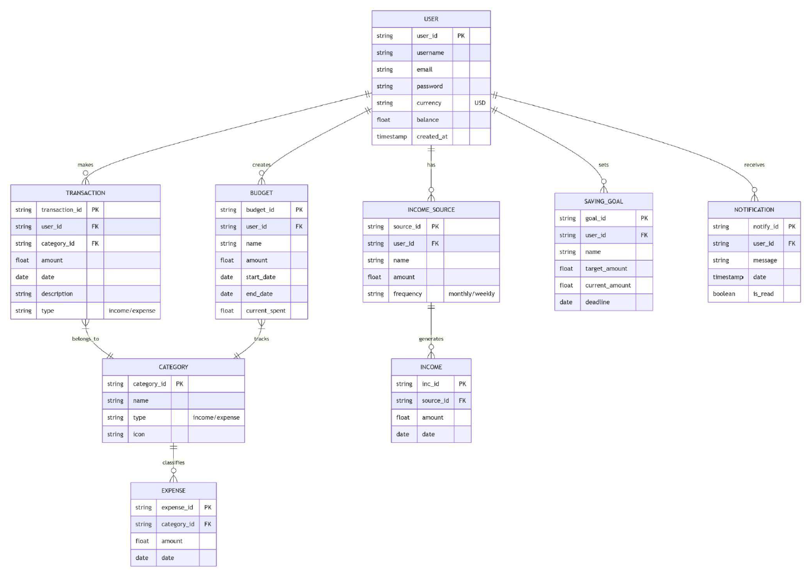

# Frugal Flow App
An Android based mobile app for budget planning, net worth calculation, transaction history, expense categorization and financial forecasting.

## Brief Overview
&nbsp; **Purpose:**
The FrugalFlow Budget Tracking App helps users manage their finances efficiently by tracking income, expenses, savings goals, and budgets in one place, while providing insights and alerts to optimize spending and achieve financial targets.

&nbsp; **Key Features:**  
- **Expense & Income Tracking**
  - Log transactions with categories (Food, Bills, etc.)
- **Budget Management**
  - Set monthly/weekly spending limits
- **Saving Goals**
  - Monitor progress
- **Smart Notification**
  - Overspending warnings

&nbsp; **Technologies Used:**
- **Frontend**
  - Android Studio (Java/XML)
- **Backend**
  - Firebase (Authentication, Firestore DB, Cloud Functions)
- **Design**
  - Figma (Monitor progress)

## Project Details

### Problem Definition
- Users struggle to track spending/income manually, leading to overspending, missed savings goals, and poor financial awareness
- Traditional methods (spreadsheets, notes) fail to provide real-time insights, alerts, or personalized budgeting strategies

### Objectives
- Help individuals take control of their fi nances by tracking income, expenses, and savings in one place
- Provide real-time alerts and insights to avoid budget breaches and encourage smarter spending habits

### Targeted Users
- Students & Budget-Conscious Individuals, Young Professionals & Freelancers

## System Design

### Database Diagram

